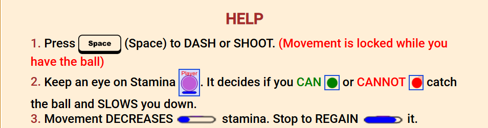

# 2D JavaScript Dodgeball Game with AI Opponents

Play it here :- https://sp3cia1.github.io/dodgeball-game/

You might have to refresh after each game, to play again. :)

## Overview

This is an **original 2D Dodgeball game** developed from scratch using **vanilla JavaScript and the Canvas API**.  The core focus of this project was to create a fast-paced, challenging, and engaging gameplay experience, with a particular emphasis on developing **intelligent AI opponents** that simulate human-like player behavior.

Unlike typical simple game AI, the opponents in this Dodgeball game are designed with advanced decision-making logic, taking into account factors like:

*   **Stamina Management:** AI players strategically manage their stamina, balancing movement and ball chasing with stamina regeneration.
*   **Opponent Positioning:** AI considers the positions of other players (both teammates and opponents) to make informed decisions about ball interception and dodging.
*   **Ball Trajectory Prediction:**  AI attempts to predict ball trajectory to intercept or evade throws effectively.
*   **Risk Assessment:** AI evaluates its chances of reaching the ball based on stamina and distance, and prioritizes stamina recovery if necessary.
*   **Randomized Behavior:**  Subtle randomization is incorporated to emulate human error and create a more unpredictable and realistic gameplay experience.

This project demonstrates a strong understanding of game development principles, JavaScript programming, object-oriented design, and advanced AI implementation in a browser-based game environment.

## Gameplay

The game starts with a 3-second countdown, positioning players around the border of the game area.  A dodgeball then appears randomly near the center.  Players (including you and AI opponents) must:

1.  **Acquire the Ball:** Move to intercept the ball. Movement is stamina-dependent; continuous movement and dashing consume stamina.
2.  **Throw or Dodge:** Once a player has the ball, they can throw it at opponents. Opponents must dodge or attempt to catch the ball.
3.  **Catching Mechanic:**  The ball's catchability is visually indicated by its color:
    *   **Green Ball:** Catchable if the player's stamina is sufficient.
    *   **Red Ball:** Deadly and cannot be caught; must be dodged.
    *   Ball color changes dynamically based on its velocity and catchability window.
4.  **Stamina Management:**  Stamina decreases with movement and dashing. Players must stop moving to regenerate stamina, adding a strategic element to gameplay.
5.  **Shields (Lives):** Each player starts with two shields (lives), allowing for more sustained gameplay before elimination.
6.  **Device-Responsive Design:** The game dynamically adapts to different device widths and heights, ensuring consistent gameplay across various screen sizes.

**Controls:**

*   **Movement:**  [Arrow Keys, WASD Keys]
*   **Dash/Shoot:** [Spacebar] (Movement is locked while holding the ball).

## Features

*   **Original 2D Dodgeball Game Design:**  Concept, rules, and gameplay mechanics are entirely original.
*   **Intelligent AI Opponents:**  Advanced AI logic simulates human-like strategic gameplay with stamina management, opponent awareness, and ball prediction.
*   **Physics-Based Ball Movement:** Realistic ball physics implemented using JavaScript Canvas.
*   **Dynamic Ball Catchability:** Ball color and catchability dynamically change based on velocity and stamina.
*   **Stamina System:**  Strategic stamina management mechanic influencing player movement and actions.
*   **Shields (Lives) System:**  Extends gameplay and prevents quick eliminations.
*   **Score Tracking:**  In-game score display to track progress.
*   **Device-Responsive Design:**  Game area and elements scale dynamically to fit different screen sizes.
*   **Engaging Sound Effects and Music:**  [If you added sound/music - mention it] Enhances the gameplay experience.
*   **Object-Oriented Programming (OOP):**  Well-structured code using classes (`Border`, `Ball`, `Player`, `Enemy`) for maintainability and scalability.
*   **Vanilla JavaScript Implementation:**  Built using pure JavaScript and Canvas API, without external game engines or frameworks.

## Technologies Used

*   **Game Engine/Framework:**  Vanilla JavaScript (Canvas API) - No external libraries or frameworks.
*   **Programming Language:** JavaScript
*   **Graphics Rendering:** HTML5 Canvas API
*   **Deployment (If Applicable):** [GitHub Pages]

